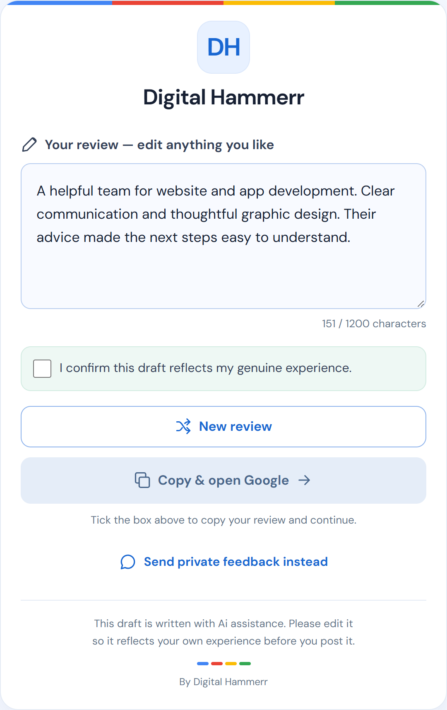
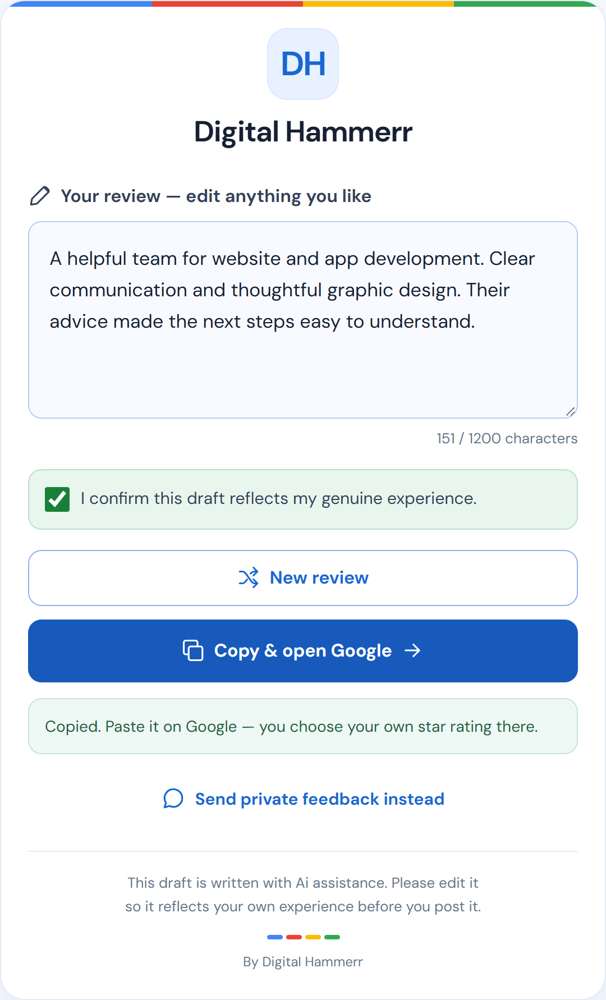
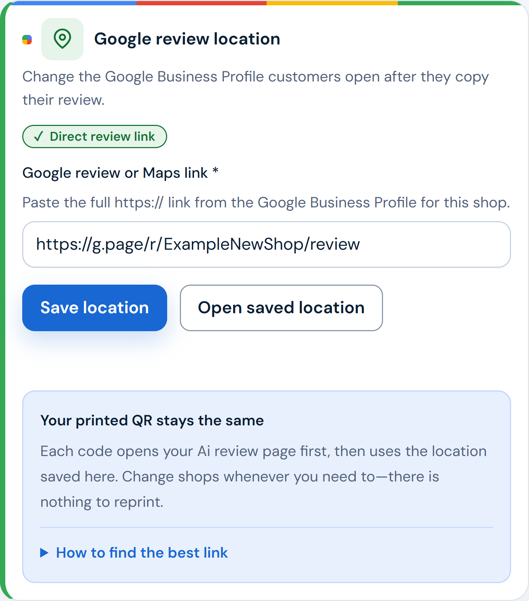

# Ai Review by Digital Hammerr

Ai Review helps local businesses collect genuine Google reviews. A business prints a QR code; a
customer scans it, picks the services they used, gets an **editable Ai-drafted review**, confirms it
reflects their real experience, copies it, and decides whether to post it on Google themselves.

The product never posts a review, never checks whether one was posted, never asks for a star rating
and never promises more reviews. It only records what it can observe: a scan, a draft, a copy, Google
being opened.

_"Ai" is written with a lowercase "i" on purpose: it is the brand's spelling
([CHANGE-002](docs/decisions/spec-amendments.md#change-002--user-facing-acronym-casing-is-ai)).
Technical names such as environment variables keep "AI"._

## At a glance

- **What it is:** a web service (software as a service, or SaaS) that many businesses share. Each
  business gets its own workspace, public page and QR codes.
- **Who pays:** business owners. **Free** includes 10 Ai drafts per business; **Pro** is paid yearly
  through Razorpay (an Indian online-payments service). Prices and allowances are settings a
  platform admin can change; the defaults are INR 999 for 12 months with 2,000 drafts.
- **Who else uses it:** the business's customers (no account needed) and the platform's own admin
  team.
- **What it never does:** post or verify reviews, collect star ratings, send only happy customers to
  Google, or promise more reviews.
- **Where it runs:** the web app is hosted on Vercel (a website-hosting service), its data is kept
  in a PostgreSQL database (a standard database system) run by Supabase (a database-hosting
  service), and email is sent through Resend (an email-sending service). Production is served at
  `aireview.digitalhammerr.com`.
- **The live site, as last recorded:** it takes test payments only, by the owner's choice, so no
  real money is collected ([payments mode](docs/decisions/open-decisions.md#payments-mode)); and
  staff sign in to the admin console with a password alone, because the owner switched off the
  authenticator-app step
  ([admin two-step sign-in](docs/decisions/open-decisions.md#admin-two-step-sign-in)).

Plain-language guides: the [product overview](docs/product/README.md) and the
[glossary](docs/glossary.md) of words used across the project.

## Not a developer? Start here

You do not need to read any code or any of the files at the top of this repository.

1. [Product overview](docs/product/README.md): what the product does, for whom, the plans, and what
   it promises and does not.
2. [Glossary](docs/glossary.md): the words the documents use, such as vendor, tenant and slug.
3. [Product decisions](docs/decisions/product-decisions.md): what the owner has approved and must not
   be undone by accident. [Open decisions](docs/decisions/open-decisions.md): questions still waiting
   for the owner.
4. [Changelog](docs/history/changelog.md): what changed and when.
5. The [documentation index](docs/README.md#for-non-developers) lists everything else, starting with
   the documents written for non-developers.

## What the customer and the business see

<p>
  
  
  
</p>

1. The customer edits the Ai draft. Copying stays locked until they confirm it reflects their own
   experience.
2. "Copy & open Google" copies the text and opens the business's Google review page in a new tab.
   There the customer picks their own star rating and decides whether to post. Private feedback to
   the business is always offered instead.
3. The business owner can change which Google listing customers are sent to without reprinting QR
   codes. The link shown is an example.

These are real screenshots of the product, taken on 18 September 2026 from a local copy with demo
data ([how they were captured](docs/media-rights/faq-screenshot-sources.md)). The website's FAQ uses
the same images.

## Who uses it

| Audience                      | What they do                                                                                                                                                                                                                                 | Where it lives                                 |
| ----------------------------- | -------------------------------------------------------------------------------------------------------------------------------------------------------------------------------------------------------------------------------------------- | ---------------------------------------------- |
| **Visitors**                  | Read the marketing site, pricing and policies                                                                                                                                                                                                | `apps/web/app/(marketing)`                     |
| **Business owners (vendors)** | Sign up, set up their business and Google review link, print QR codes, see feedback and analytics, pay for Pro                                                                                                                               | `apps/web/app/(auth)`, `apps/web/app/(vendor)` |
| **Customers**                 | Scan a QR or open a business page, get a draft review, or leave private feedback                                                                                                                                                             | `apps/web/app/(customer)`                      |
| **Platform admins**           | Manage businesses, payments, prompts, settings and the admin team. A code from an authenticator app (MFA) is required by default; `ADMIN_MFA_REQUIRED` can switch it off (see [security](docs/architecture/security.md#admin-roles-and-mfa)) | `apps/web/app/(admin)`                         |

## How it is built

```text
Browser (visitor / vendor / customer / admin)
        │
        ▼
apps/web ─ Next.js 16 app: pages, React components and the JSON API (/api/v1/*) in one deployable
        │
        ├─► packages/core      domain logic: Ai generation, prompts, quotas, billing, auth, tenancy
        ├─► packages/db        Drizzle schema + migrations ──► PostgreSQL
        ├─► Redis              shared rate limits (falls back to in-memory when absent)
        ├─► Ai provider        draft generation (configured by environment)
        ├─► Razorpay           Pro checkout, payments, refunds
        └─► Resend             transactional email

Vercel Cron ──► /api/cron/* ──► subscription, health and maintenance jobs
apps/worker (optional, not deployed) ──► the same maintenance jobs on BullMQ
```

TypeScript throughout: Node 24+, pnpm workspaces, Next.js 16, React 19, Drizzle ORM on PostgreSQL,
Tailwind CSS 4 with CSS Modules, Vitest and Playwright. More detail:
[architecture overview](docs/architecture/overview.md), which also has the full repository map.

## Repository map

| Path                                             | What is in it                                                                                     |
| ------------------------------------------------ | ------------------------------------------------------------------------------------------------- |
| [`apps/web`](apps/web/README.md)                 | The Next.js app — all UI and the backend API. This is what gets deployed (Vercel root directory). |
| ├ [`app/`](apps/web/app/README.md)               | Routes, grouped by audience: `(marketing)`, `(customer)`, `(auth)`, `(vendor)`, `(admin)`, `api`  |
| ├ [`lib/`](apps/web/lib/README.md)               | Server and shared logic, one folder per concern (`auth`, `http`, `customer`, `ai`, `qr`, `crm`…)  |
| └ [`components/`](apps/web/components/README.md) | React UI, one folder per audience plus `shared/`                                                  |
| [`apps/worker`](apps/worker/README.md)           | Optional standalone background worker (BullMQ); not deployed                                      |
| [`packages/`](packages/README.md)                | Internal libraries: `core`, `db`, `contracts`, `config`, `analytics`, `ui`                        |
| [`scripts/`](scripts/README.md)                  | Local dev stack, database tools, operator tools, media renderers, code generation                 |
| [`e2e/`](e2e/README.md)                          | Automated browser tests ("end-to-end"), written with Playwright and grouped by audience           |
| [`docs/`](docs/README.md)                        | Product guides, architecture, features, operations runbooks, decisions, history, the frozen spec  |
| [`.github/workflows/`](.github/workflows/ci.yml) | The automatic checks (CI) that run on every pull request and every push to `main`                 |

## What are all these files at the root?

Only developers need these. Everything a non-developer needs is linked from this README.

| File                                               | What it is                                                                                                                 |
| -------------------------------------------------- | -------------------------------------------------------------------------------------------------------------------------- |
| `README.md`                                        | This page                                                                                                                  |
| [`CONTRIBUTING.md`](CONTRIBUTING.md)               | How to make a change: where code goes, conventions, the checks to run before a pull request                                |
| [`AI_HANDOVER.md`](AI_HANDOVER.md)                 | Brief and ground rules for AI coding agents working on this repository                                                     |
| [`AGENTS.md`](AGENTS.md), [`CLAUDE.md`](CLAUDE.md) | Short files AI coding tools load automatically; they point to `AI_HANDOVER.md`                                             |
| `package.json`                                     | The project's name, the minimum Node version, the pinned pnpm version, and command shortcuts (`pnpm run` lists them)       |
| `pnpm-lock.yaml`                                   | Exact versions of every third-party library. Generated by pnpm; never edit by hand                                         |
| `pnpm-workspace.yaml`                              | Lists the `apps/*` and `packages/*` folders, and which libraries may run install scripts                                   |
| `.npmrc`                                           | Package-installer settings (how peer dependencies are handled)                                                             |
| `.env.example`                                     | The name of every setting, with explanations and safe local defaults. No real secrets; copy it to `.env` (see below)       |
| `tsconfig.base.json`                               | Strict TypeScript compiler settings that every app and package extends                                                     |
| `eslint.config.mjs`                                | Lint rules, including the check against "review submitted" wording and the import boundaries between folders in `apps/web` |
| `.prettierrc`, `.prettierignore`                   | Code-formatting rules, and what formatting skips (the frozen spec, migrations, generated files)                            |
| `vitest.config.mts`                                | Unit-test settings (no database needed)                                                                                    |
| `vitest.integration.config.mts`                    | Integration-test settings: tests under `__tests__/integration/`, which need PostgreSQL                                     |
| `playwright.config.ts`                             | Browser-test settings for `e2e/`: desktop Chrome, plus a phone-sized project for customer tests                            |
| `.gitignore`                                       | What Git never records (secrets, downloaded libraries, build output, local data)                                           |
| `.gitattributes`                                   | Line-ending rules, binary files, and which files GitHub marks as generated                                                 |
| `.vercelignore`                                    | What a command-line upload to Vercel must never include                                                                    |

## Local-only folders you may see

A fresh `git clone` contains none of these except `apps/web/next-env.d.ts`, which is tracked but
rewritten locally. The others appear on a machine where the project has been installed and run, or
in a copy of someone's working folder, and Git ignores them all.

| Item                                                       | What it is                                                                                                                                                                                          | Safe to delete?                                                                         | Contains secrets?                                                                                                      |
| ---------------------------------------------------------- | --------------------------------------------------------------------------------------------------------------------------------------------------------------------------------------------------- | --------------------------------------------------------------------------------------- | ---------------------------------------------------------------------------------------------------------------------- |
| `node_modules/` (at the root and in every app and package) | Third-party libraries downloaded by `pnpm install`                                                                                                                                                  | Yes. `pnpm install` recreates it                                                        | No                                                                                                                     |
| `apps/web/.next/`                                          | Next.js build output and dev-server cache                                                                                                                                                           | Yes, with the dev server stopped. `next dev` or `next build` recreates it               | No                                                                                                                     |
| `apps/web/tsconfig.tsbuildinfo`                            | TypeScript's cache for faster type checks                                                                                                                                                           | Yes                                                                                     | No                                                                                                                     |
| `apps/web/next-env.d.ts`                                   | Tracked in Git, but rewritten by Next.js: `next dev` points it at `.next/dev/types`, `next build` back at `.next/types`. Git then shows it as modified; that is not anyone's work, do not commit it | No (it is tracked). `git restore apps/web/next-env.d.ts` or the next build puts it back | No                                                                                                                     |
| `.env`                                                     | Your local settings and generated secrets. The app, tests and scripts read it                                                                                                                       | **No.** Deleting or overwriting it makes stored local passwords stop working            | **Yes**                                                                                                                |
| `.env.supabase.local`                                      | The owner's connection details for the production database, used only by the database runbooks. The app never reads it                                                                              | Owner only                                                                              | **Yes**: the production database password                                                                              |
| `.env.local`                                               | Written by the Vercel command-line tool (`vercel link`, `vercel env pull`). Nothing in the repository reads it                                                                                      | Yes                                                                                     | **Yes**: a Vercel access token, and production values after `vercel env pull`                                          |
| `.vercel/`                                                 | Links this folder to the Vercel project (`project.json`), created by `vercel link`                                                                                                                  | Yes, but a command-line deploy then needs `vercel link` again                           | Project IDs only. Any `.env.*.local` file that `vercel pull` writes here holds production secrets; delete it after use |
| `.pgdata/`                                                 | The local PostgreSQL database started by `pnpm db:dev` or `pnpm dev:up`. Development data, but not confirmed disposable (see below the table)                                                       | Only if you accept losing your local data. Never delete it to get past an error         | No production secrets (local accounts with hashed passwords). Never load production data into it                       |
| `.dev/`                                                    | Logs and process IDs written by `pnpm dev:up`                                                                                                                                                       | Yes, after `pnpm dev:down` (which reads the process IDs)                                | Can contain live password-reset or invite links printed by the development mailer; do not share it                     |
| `test-results/`                                            | Output of the last Playwright run: screenshots and traces of failed tests                                                                                                                           | Yes                                                                                     | No (test data only)                                                                                                    |
| `.agents/`, `skills-lock.json`                             | Reference material for AI coding assistants (Resend email "skills"), installed by the `skills` tool. The app, build and tests do not use them                                                       | Yes                                                                                     | No                                                                                                                     |

`.pgdata/` holds development data only, but on the owner's machine it is not confirmed disposable:
ask the owner before running migrations, the seed or the database tests against it, or use
[a separate database for tests](docs/operations/local-development.md#a-separate-database-for-tests).

One-off database-migration scripts, a portable PostgreSQL client and pulled production settings that
once sat in this folder have moved to the owner's private backup folder outside the repository.
Nothing there is needed to build, run or test the project.

**Share the project with `git clone`, never by zipping or copying this folder.** A working folder
contains the secret files above, which Git deliberately leaves out. Send secrets separately, through
a secure channel.

## Getting started

### What to install

| Tool                   | Why                                                                                                                                                                                                                      |
| ---------------------- | ------------------------------------------------------------------------------------------------------------------------------------------------------------------------------------------------------------------------ |
| Git                    | To clone the repository                                                                                                                                                                                                  |
| Node.js 24 or newer    | Runs everything                                                                                                                                                                                                          |
| pnpm 11                | Installs libraries and runs the commands. `corepack enable` picks up the pinned version from `package.json`                                                                                                              |
| `cloudflared`          | Cloudflare's tunnel tool. `pnpm dev:up` needs it and does not start the app without it (Windows: `winget install --id Cloudflare.cloudflared`; macOS: `brew install cloudflared`)                                        |
| PostgreSQL 17 or newer | **Windows:** nothing to install; `pnpm dev:up` runs a bundled database server. **macOS and Linux:** install your own and have it listening on `localhost:5432` before `pnpm dev:up`, which reuses whatever answers there |
| Google Chrome          | Only for the browser tests, which drive the installed Chrome                                                                                                                                                             |

Redis is optional locally: `REDIS_URL` must be set, but if nothing answers, rate limits fall back to
memory.

### First run

```bash
git clone <repository URL>
cd <the cloned folder>
pnpm install
```

Create your `.env` from the template, **only if there is no `.env` yet**. Never overwrite an existing
one: it holds the secrets that local passwords were hashed with.

```bash
[ -f .env ] || cp .env.example .env    # macOS, Linux, Git Bash
```

```powershell
if (-not (Test-Path .env)) { Copy-Item .env.example .env }    # Windows PowerShell
```

Then edit `.env`:

1. **Generate the three required secrets.** `SESSION_SECRET`, `APP_ENCRYPTION_KEY` and `HASH_PEPPER`
   are blank in the template and the app refuses to start without them. Run this once per secret and
   paste each result after its `=`:

   ```bash
   node -e "console.log(require('crypto').randomBytes(32).toString('base64url'))"
   ```

   Once your database holds accounts, never change `HASH_PEPPER` (passwords stop verifying) or
   `APP_ENCRYPTION_KEY` (admin authenticator set-ups stop working).

2. **Check `DATABASE_URL` and `DIRECT_DATABASE_URL`.** The template's `DATABASE_URL` already
   matches the bundled Windows database that `pnpm dev:up` starts (`scripts/dev/dev-db.mjs`); leave
   it as is on Windows. On macOS or Linux, put your own server's address here. Leave
   `DIRECT_DATABASE_URL` blank: when it is set, `pnpm dev:up` and the migrate command apply
   migrations to it instead of `DATABASE_URL`. Keep both on your own machine, pointing at a
   database you are allowed to overwrite: migrations, the seed and the test suites write to
   whatever they name.
3. **Leave the rest blank for now.** With no Ai provider key, drafts come from a free built-in stub.
   With no `RESEND_API_KEY`, emails are printed to the log instead of sent. With no Razorpay keys,
   the upgrade button says payments are not set up.

Every variable is explained in [environment](docs/operations/environment.md).

On a machine whose database you did not create yourself (for example the owner's), ask the owner
before running `pnpm dev:up` or the seed: `dev:up` migrates that database, and the seed resets the
demo owner's password in it. AI coding agents ask before any migration or seed; see
[AI_HANDOVER.md](AI_HANDOVER.md#1-first-instructions).

```bash
pnpm dev:up        # database, migrations, public tunnel, dev server (background)
# create the demo business; prints the demo owner's email and password:
node --env-file=.env node_modules/tsx/dist/cli.mjs scripts/db/seed.ts
pnpm dev:status    # what is running, and the address to open
pnpm dev:down      # stop everything
```

`pnpm dev:up` starts the local PostgreSQL if nothing is listening on port 5432, applies any pending
migrations to `DIRECT_DATABASE_URL` (or, when that is blank, `DATABASE_URL`) from `.env`, opens a
Cloudflare tunnel so a phone can scan local QR codes, writes that tunnel address into `.env` as
`APP_BASE_URL` and `API_BASE_URL`, and starts `next dev`.
**The tunnel address is public:** anyone who has it can reach your local app. If you do not need a
phone, or do not have `cloudflared`, run the database and the dev server yourself instead
([separate terminals](docs/operations/local-development.md#option-b-separate-terminals)).

Full walkthrough, including what the seed writes: [local development](docs/operations/local-development.md).

## Common commands

| Command                              | What it does                                                                                                                                                     |
| ------------------------------------ | ---------------------------------------------------------------------------------------------------------------------------------------------------------------- |
| `pnpm --filter @ai-review/web dev`   | Just the Next.js dev server (you provide the database)                                                                                                           |
| `pnpm dev`                           | **Avoid.** Starts the web app **and** the optional background worker (`apps/worker`), which schedules maintenance jobs against your database. Use the line above |
| `pnpm test`                          | Unit tests (Vitest, no database needed)                                                                                                                          |
| `pnpm test:integration`              | Integration tests. They create and delete rows in the database `DATABASE_URL` names                                                                              |
| `pnpm e2e`                           | Playwright browser tests. Need the dev server and a seeded database, and write to that database                                                                  |
| `pnpm typecheck` / `pnpm lint`       | TypeScript across all workspaces / ESLint                                                                                                                        |
| `pnpm format:check`                  | Prettier check, as run in CI. To fix a failure, format only your files: `pnpm exec prettier --write <files>`                                                     |
| `pnpm db:generate`                   | Create a migration from schema changes (no database needed). Ask the owner first ([contributing](CONTRIBUTING.md#before-you-start))                              |
| `pnpm --filter @ai-review/web build` | Production build of the web app                                                                                                                                  |

Migrating and seeding are not in the table because `pnpm db:migrate` and `pnpm seed` do not read
`.env`. Run them through Node instead (canonical forms:
[local development](docs/operations/local-development.md#first-time-setup)):

```bash
node --env-file=.env node_modules/tsx/dist/cli.mjs packages/db/src/migrate.ts   # apply migrations
node --env-file=.env node_modules/tsx/dist/cli.mjs scripts/db/seed.ts           # demo business
```

The migrate command changes the database that `DIRECT_DATABASE_URL` names, or the `DATABASE_URL`
one when that is blank. The seed creates or refreshes the demo business and prints the demo owner's
password; run it only on a local database you are allowed to overwrite. Do not shorten these to
`node --env-file=.env --run …`: on Node 24 that form does not pass `.env` to the script.

Before running anything else, read the
[commands with side effects](docs/operations/local-development.md#commands-with-side-effects).

CI (`.github/workflows/ci.yml`) runs format, lint, typecheck, the migration guard, the analytics
taxonomy check, unit tests, integration tests, the web build and a dependency audit. Details:
[testing](docs/operations/testing.md#continuous-integration).

## Where to go next

- **Not a developer:** [product overview](docs/product/README.md) and [glossary](docs/glossary.md).
- **New to the codebase:** [docs index](docs/README.md) → [architecture overview](docs/architecture/overview.md)
  → [routes](docs/architecture/routes.md) → the feature doc for what you are touching.
- **Changing something:** [contributing guide](CONTRIBUTING.md) — conventions, checks, commits.
- **Deploying or operating:** [operations docs](docs/README.md#operations) — never deploy, and never
  run migrations against a shared or production database, without the owner's go-ahead.
- **Why something is the way it is:** [product decisions](docs/decisions/product-decisions.md),
  [spec amendments](docs/decisions/spec-amendments.md) (the change record for the original spec in
  [`docs/spec/`](docs/spec/README_FIRST.md)) and [project history](docs/history/changelog.md).
- **Open problems:** [known issues](docs/known-issues.md) and
  [open decisions](docs/decisions/open-decisions.md).

## Ground rules

- Never commit secrets. The real `.env` stays local; `.env.example` lists variable names only.
- Share the project through Git, never as a zip or copy of a working folder.
- `docs/spec/` is the frozen, delivered specification — never edit or reformat it. Record changes to
  it in [`docs/decisions/spec-amendments.md`](docs/decisions/spec-amendments.md).
- Never edit an applied migration in `packages/db/drizzle/`; add a new one.
- Product wording: the brand is "Ai Review" ("Ai drafts"), and the product may only say Google was
  _opened_ — never that a review was submitted or posted. `pnpm lint` (and so CI) fails on "review
  submitted" wording; it does not catch "posted", which only the browser tests and review catch.
