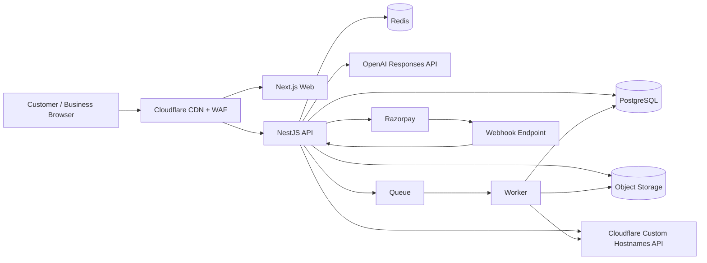

# System Architecture

## Recommended production stack (August 2026 baseline)

### Web
- **Next.js 16.3.3 Active LTS**, TypeScript.
- React server/client components as appropriate.
- Tailwind CSS + accessible component primitives.
- Zod for shared request/form validation.

### API
- Node.js **24 LTS**.
- NestJS with Fastify adapter, TypeScript.
- REST API documented by OpenAPI.
- Stateless API containers.

### Data
- PostgreSQL **18.x** (current supported major line; deploy the latest security patch approved in staging).
- Redis for rate limiting, short-lived cache, locks and queues.
- Object storage compatible with S3 for logos, covers, galleries and exported QR assets.

### AI
- OpenAI **Responses API**.
- Default high-volume generation model: `gpt-5.6-luna`.
- Optional controlled fallback/quality canary: `gpt-5.6-terra`.
- Structured Outputs with strict JSON schema for predictable response parsing.
- AI model and prompt version stored in database/admin config; never hard-coded only in source.

### Edge, DNS, custom domains
- Cloudflare for WAF/CDN/rate controls.
- Cloudflare for SaaS custom hostnames for customer-owned domains/subdomains and automated TLS where commercial terms are acceptable.
- Platform canonical host: `review.digitalhammerr.com`.

### Payments
- Razorpay Subscriptions/Checkout.
- Server-side signature verification and webhooks.
- Annual plan: ₹999/year.

### Infrastructure recommendation
- AWS Mumbai region (`ap-south-1`) for core application/data.
- Cloudflare in front of the public web/API.
- ECS Fargate services:
  - `web`
  - `api`
  - `worker`
- RDS PostgreSQL.
- ElastiCache/managed Redis.
- S3 or R2 for assets.
- AWS SES or equivalent transactional email service.

The exact managed vendors may change, but service boundaries and contracts should not.

## Logical architecture

## Multi-tenant model
- `businesses.id` is the tenant key.
- Business-owned records carry `business_id` directly whenever practical.
- Every authenticated business API query must scope by the server-resolved active business, never by trusting a client-supplied `business_id` alone.
- Super-admin endpoints are isolated under `/admin/*` and require explicit admin role.
- Custom domain requests resolve hostname -> `custom_domains.business_id` -> public tenant configuration.

## Request paths

### Canonical public profile
`GET review.digitalhammerr.com/{businessSlug}`

### Dynamic QR
`GET review.digitalhammerr.com/r/{qrCode}`

`qrCode` resolves to a business and a QR source label, records the scan, then returns/redirects to the public AI review experience.

### Customer custom domain
`GET review.customer.com/`

Hostname lookup resolves the business. Path behavior follows the same public renderer.

## Scalability strategy
- Stateless web/API containers: horizontal autoscaling.
- PostgreSQL connection pooling.
- Redis for distributed rate limits and dedupe locks.
- Append-only analytics events written asynchronously when possible.
- Precomputed daily aggregates for dashboard charts.
- Public business configuration cached by `business_id + config_version`.
- QR resolution cached by `qr_code` with short TTL and explicit invalidation.
- Asset delivery via CDN.
- AI concurrency guarded per tenant and platform.

## Availability / failure behavior
- If AI provider is unavailable, show a friendly retry state; never block the business profile or direct Google button.
- If analytics pipeline is degraded, customer flow must continue; events may queue/retry.
- If Razorpay is unavailable, existing paid accounts continue based on local entitlement cache; new payment attempts show retry.
- If a custom domain fails, canonical Digital Hammerr URL remains usable.

## Data consistency
Use database transactions for:
- subscription entitlement transitions;
- free quota consumption + AI generation record creation;
- QR creation + unique code reservation;
- business slug changes;
- custom domain activation status changes where local state depends on external confirmation.

## Public performance
- Cache public business profile config at edge/server.
- Do not load dashboard JavaScript on public review page.
- Lazy-load optional gallery media.
- Generate QR SVG server-side; PNG export can be asynchronous.
- Analytics call should use `keepalive`/beacon style where appropriate.

## Security boundaries
- Public AI endpoint uses signed/opaque public business token or slug resolution server-side.
- Never expose internal prompt text, API keys, raw provider errors, payment secrets or admin IDs.
- Rate-limit by IP, anonymous session, QR code and business.
- CSRF protection for authenticated mutations when cookie auth is used.
- Rotate sessions on password reset and sensitive account changes.

## Current-source verification used for this architecture
- Next.js announced 16.3.3 as Active LTS in its August 2026 security release.
- Node.js lists v24 "Krypton" as LTS in August 2026.
- PostgreSQL 18 is the current supported major version; 18.6 was released 13 August 2026.
- Cloudflare for SaaS supports customer custom hostnames and automated TLS workflows.
- Razorpay exposes plan/subscription APIs including yearly periods.
- OpenAI recommends GPT-5.6 Luna for cost-sensitive, high-volume workloads and supports Structured Outputs via the Responses API.
