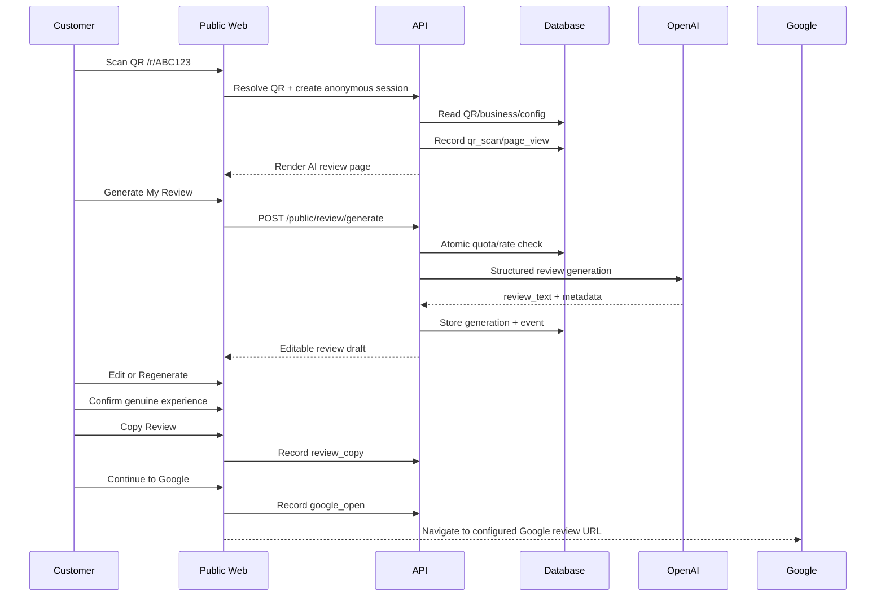

# User Flows

## Flow A - self-service business signup
1. Visitor opens `/signup`.
2. Creates owner account.
3. System creates onboarding business shell.
4. Business completes identity/category/slug.
5. Adds Google review URL.
6. Adds default social/contact links.
7. Adds AI business context and default review mode.
8. System shows non-quota preview.
9. Business publishes.
10. System creates default Dynamic QR source `Main QR`.
11. Business downloads QR or orders a standee outside/inside the later standee workflow.
12. Dashboard starts at Free plan with 10 remaining billable AI generations.

## Flow B - Digital Hammerr-assisted business creation
1. Admin creates invited business and owner email/mobile.
2. System sends secure invite/set-password link.
3. Admin may prefill business profile, links and Google review URL.
4. Owner accepts invite and reviews configuration.
5. Owner publishes or admin publishes with explicit support authorization.
6. All admin changes are audited.

## Flow C - dynamic QR customer journey

## Flow D - regeneration
1. Customer has an existing generated draft.
2. Customer presses `Regenerate`.
3. API passes previous draft(s), business factual context and active mode to AI.
4. AI must return a materially different candidate.
5. Server runs similarity/quality checks.
6. If too similar or non-compliant, one internal retry may occur.
7. New generation is stored with `parent_generation_id` and increments generation usage according to quota policy (recommended: every provider generation counts; preview tests do not).
8. UI replaces draft but allows browser-level undo/edit history if feasible.

## Flow E - free quota -> paid
1. Each actual public AI generation atomically increments free usage for a Free business.
2. At 10 successful generations, future Generate requests return `PLAN_QUOTA_EXHAUSTED`.
3. Public customer receives a business-safe message: review assistant temporarily unavailable; direct Google review button remains available.
4. Business dashboard shows upgrade CTA.
5. Owner starts Razorpay checkout/subscription.
6. Server verifies checkout signature and webhook.
7. Entitlement becomes `PRO_ACTIVE`.
8. AI generation resumes under fair-use controls.

## Flow F - manual personal review request
1. Business adds/selects customer.
2. Opens `Review Requests`.
3. System renders message using `{customer_name}`, `{business_name}`, `{review_link}`.
4. Owner can edit template/preview.
5. `Copy Message` copies to clipboard; optional manual status `Message Prepared`.
6. `Open WhatsApp` opens a prefilled WhatsApp/deep-link URL. AI Review itself sends nothing.
7. Owner manually sends from own number.
8. Owner may click `Mark Message Sent`.
9. If recipient later opens tracked review link, analytics can attribute a click to a request token without exposing customer identity in public analytics.

## Flow G - private feedback
1. Private Feedback is shown to all users, not only low-rating users.
2. Customer submits message; name/mobile optional.
3. API rate-limits spam and validates text.
4. Feedback goes to business inbox.
5. Business can mark read/archive.
6. No automatic diversion based on a star rating exists because the product does not ask for one.

## Flow H - custom domain
1. Business enters `review.example.com`.
2. API validates hostname format and checks it is not already claimed.
3. Backend creates custom hostname with provider.
4. UI displays CNAME/TXT instructions returned by provider/our configuration.
5. Business changes DNS.
6. Worker polls or webhook updates verification/certificate state.
7. When active, hostname resolves tenant via `custom_domains`.
8. Canonical `review.digitalhammerr.com/{slug}` remains usable.
9. Removing custom domain does not remove business or QR codes.

## Flow I - slug change
1. Owner requests new slug.
2. Server validates availability.
3. Change occurs transactionally.
4. Old slug is stored as redirect alias for a configurable retention period, recommended 180 days.
5. Dynamic QR is unaffected because it uses opaque QR code, not slug.

## Flow J - expired/suspended business
- **Expired paid plan:** retain account/profile; AI generation entitlement follows product policy (recommended: return to Free quota only if free quota was not already consumed; otherwise direct review link remains available). Business links may remain live to encourage renewal unless commercial policy decides otherwise.
- **Admin suspended for abuse:** public page shows unavailable status; no AI generation; admin reason logged.
- **Deleted/closed account:** use soft-delete/closure grace period before irreversible purge.
